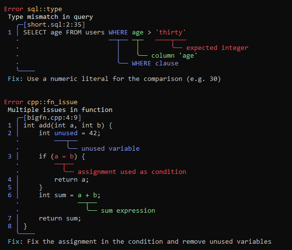
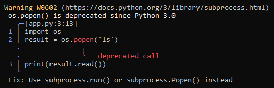

# CaraReport



## Overview

CaraReport is a lightweight C++ reporting library mainly designed for Caracal. It provides a simple API for generating diagnostics.

## Requirements

- CMake >= 3.30
- Ninja (or any CMake generator you prefer)
- A C++20 compatible compiler (MSVC, clang, gcc)

## Example



```cpp
#include <CaraReport.h>

using namespace CaraReport;

int main() {
    auto source = std::make_unique<Source>(
        "app.py", "import os\nresult = os.popen('ls')\nprint(result.read())");
    auto report = Report("os.popen() is deprecated since Python 3.0")
        .withTitle("W0602")
        .withLevel(Level::Warning)
        .withFix("Use subprocess.run() or subprocess.Popen() instead")
        .withUrl("https://docs.python.org/3/library/subprocess.html")
        .withSource(std::move(source))
        .withLabel(Label(22, 5, "deprecated call", true));

    printReport(report);
}
```

For more examples look at the examples project in the [Examples](https://github.com/Caracal-Lang/CaraReport/tree/main/Examples) repository.
